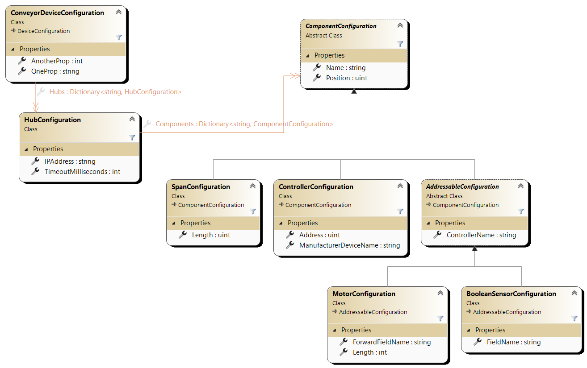

# CK.DeviceModel.Configuration package

This small packages reacts to changes in the application's [configuration](https://docs.microsoft.com/en-us/dotnet/core/extensions/configuration)
section named **"CK-DeviceModel"** and can create, reconfigure or destroy devices automatically.

The "CK-DeviceModel" configuration contains:
- A "Daemon" section (optional).

  - A "StoppedBehavior" (optional) that can be "None" (the default), "ClearAllHosts" or "ClearAllHostsAndWaitForDevicesDestroyed".
 
- Multiple sections named with the "[IDeviceHost](../CK.DeviceModel/Host/IDeviceHost.cs)`.DeviceHostName`".

  - Each [DeviceHostConfiguration](../CK.DeviceModel/Host/DeviceHostConfiguration.cs) can be specialized (and can totally control their 
  configuration handling), but by default they have:

    - The optional "IsPartialConfiguration" that defaults to true (this is the safest option).
    - The "Items" section that defines named devices associated to their [DeviceConfiguration](../CK.DeviceModel/DeviceConfiguration.cs).

Below a commented JSON configuration sample:

```jsonc
{
  // The root section must be CK-DeviceModel.
  "CK-DeviceModel": {
    // The Daemon is a special (optional) host.
    "Daemon": {
      // Can be "None" (the default) or ""ClearAllHosts".
      "StoppedBehavior": "ClearAllHostsAndWaitForDevicesDestroyed" 
    },
    // Hosts are found thanks to their name. 
    "FlashBulbHost": {
      // Optionally, hosts can have their own configuration if needed,
      // but by default only the Items (the devices) are handled.
      "Items": {
        // Devices are named objects.
        "FlashBulb n°1":
        {
          "Status": "AlwaysRunning",
          "FlashColor": 45,
          "FlashRate": 100
        },
        "FlashBulb n°2":
        {
          "Status": "RunnableStarted",
          "ControllerKey": "WebAPI"
          "FlashColor": 12,
        }
      }
    },
    "AnotherHost": {
      "IsPartialConfiguration": false, // Only D1 and D2 devices will exist.
                                       // Others will be destroyed: this configuration
                                       // fully drives the AnotherHost's devices.
      "Items": {
        "D1":
        {
          "Status": "Disabled",
          "Powers": [45, 23, 17]
        },
        "D2":
        {
          "Status": "Runnable",
          "ControllerKey": "WebAPI-Only", // Commands with any other controller key
                                          // will be ignored by default.
          "BaseImmediateCommandLimit": 1  // Defaults to 10. Here we want to execute
                                          // one regular command after each immediate one.
        }
      }
    }
  }
}
```
## Polymorphic configuration: taking control of the binding
For the majority of the devices, the DeviceConfiguration is composed of properties with basic types (string, int, etc.)
and simple Poco objects. However, sometimes, one need to express a more complex configuration that requires some polymorphism.
The standard .Net configuration binder is not a "deserializer", it cannot map/resolve types at binding type. An example of
such configuration is:



A Hub has a list of abstract Components: the standard binder has no way to know what class must be instantiated, nor does
the simple deserialization constructor: we must handle the types ourselves.

Let's start with the simple serializable pattern (as it requires no other knowledge than the basic [ICKBinaryReader/Writer](https://github.com/Invenietis/CK-Core/tree/develop/CK.Core/SimpleSerialization#readme)
API). First, the serialization must write the runtime type of the components. This can be done at the each component level but this
is harder to maintain. It's easier and more maintainable in a micro closed world like this to handle it while serializing the
list of Components (at the HubConfiguration level):
```csharp
internal void Write( ICKBinaryWriter w )
{
    w.Write( (byte)0 ); // version
    w.WriteNullableString( IPAddress );
    w.Write( TimeoutMilliseconds );
    w.WriteSmallInt32( Components.Count );
    foreach( var c in Components.Values )
    {
        w.Write( (byte)( c switch
        {
            ControllerConfiguration => 3,
            MotorConfiguration => 2,
            BooleanSensorConfiguration => 1,
            SpanConfiguration => 0,
            _ => Throw.InvalidDataException<byte>()
        }));
        c.Write( w );
    }
}
```
Now, the deserializer can correctly restore the appropriate type:
```csharp
internal HubConfiguration( ICKBinaryReader r )
{
    r.ReadByte(); // version
    IPAddress = r.ReadNullableString();
    TimeoutMilliseconds = r.ReadInt32();
    int c = r.ReadSmallInt32();
    while( --c >= 0 )
    {
        var comp = ReadComponent( r );
        Components.Add( comp.Name, comp );
    }

    static ComponentConfiguration ReadComponent( ICKBinaryReader r )
    {
        return r.ReadByte() switch
        {
            0 => new SpanConfiguration( r ),
            1 => new BooleanSensorConfiguration( r ),
            2 => new MotorConfiguration( r ),
            3 => new ControllerConfiguration( r ),
            _ => Throw.InvalidDataException<ComponentConfiguration>()
        };
    }
}
```

For the configuration, it's a little bit less evident. First you need to know the nice
standard [.Net configuration model](https://learn.microsoft.com/en-us/dotnet/core/extensions/configuration).
Basically, whatever the configuration source is, the configuration is normalized to a simple
`Dictionary<string,string>`. The json below and its `IConfiguration` representation are from the link above:
```json
{
  "Parent": {
    "FavoriteNumber": 7,
    "Child": {
      "Name": "Example",
      "GrandChild": {
        "Age": 3
      }
    }
  }
}
```
| Key   | Value |
|-------|------|
| `"Parent:FavoriteNumber"` | `"7"` |
| `"Parent:Child:Name"` | `"Example"` |
| `"Parent:Child:GrandChild:Age"` | `"3"` |

The easiest and default way to obtain a configured configuration object from such `IConfiguration` is
to use the extension methods `Get` or `Bind` provided by the [Microsoft.Extensions.Configuration.Binder](https://www.nuget.org/packages/Microsoft.Extensions.Configuration.Binder/)
package that work on [`IConfigurationSection`](https://learn.microsoft.com/fr-fr/dotnet/api/microsoft.extensions.configuration.iconfigurationsection).

Taking control of the binding starts at the DeviceConfiguration level by defining a constructor that
the configurator will call (instead of doing a simple `Get` of the device configuration type when only the
default constructor is present):
```csharp
public ConveyorDeviceConfiguration( IActivityMonitor monitor, IConfigurationSection configuration )
{
    configuration.CreateSectionWithout( nameof(Hubs) ).Bind( this );
    foreach( var hC in configuration.GetSection( nameof(Hubs) ).GetChildren() )
    {
        if( !hC.Exists() )
        {
            monitor.Warn( $"Hub named '{hC.Key}' (path: '{hC.Path}') is empty. it is ignored." );
        }
        else
        {
            Hubs.Add( hC.Key, new HubConfiguration( monitor, hC ) );
        }
    }
}
```
The goal of this dedicated constructor is to be able to provide the right `IConfigurationSection` down to
the classes (in our case the Components) that need it. The trick is to use the standard `Bind` for **all the
regular properties** (so that we don't have to handle each of them manually!) but NOT for the ones that need to
handle the configuration (otherwise, you'll ask the standard binder to do impossible things for him!).

To ease this, the [`CreateSectionWithout`](../CK.DeviceModel/ConfigurationExtensions.cs) extension method is
kindly implemented and publicly exposed by CK.DeviceModel package.
Thanks to `configuration.CreateSectionWithout( "Hubs" )).Bind( this )`, we are done with all the regular
properties: we just have to loop on the "Hubs" section and rely on the Hub dedicated constructor to initialize
the hub objects.

Notes:
- A constructor without the `IActivityMonitor` can be defined.
- If you need to hide 2 or more properties to the standard binding, simply compose the function: 
  `configuration.CreateSectionWithout( "Hubs" ).CreateSectionWithout( "OtherComplexProperty" ).Bind( this );

The final touch is the `HubConfiguration` constructor in which we map the name of the "Type" configuration
property to the C# type to instantiate:
```csharp
internal HubConfiguration( IActivityMonitor monitor, IConfigurationSection configuration )
{
    configuration.CreateSectionWithout( nameof( Components ) ).Bind( this );
    foreach( var cC in configuration.GetSection( nameof( Components ) ).GetChildren() )
    {
        if( !cC.Exists() )
        {
            monitor.Warn( $"Component named '{cC.Key}' is an empty section. it is ignored." );
        }
        else
        {
            var c = CreateComponent( monitor, cC );
            if( c != null )
            {
                Debug.Assert( c.Name == cC.Key );
                Components.Add( c.Name, c );
            }
        }
    }

    static ComponentConfiguration? CreateComponent( IActivityMonitor monitor, IConfigurationSection c )
    {
        var tName = c["Type"];
        if( string.IsNullOrWhiteSpace( tName ) )
        {
            monitor.Error( $"Missing or invalid Type name for '{c.Path}'." );
            return null;
        }
        // Unfortunately Configuration keys are case insensitive (one cannot use a nice switch expression
        // without hideous ToLowerInvariant). If one need more than this few types, these if can be replaced
        // by a static Dictionary<string,Type> mapping.
        Type t;
        if( tName.Equals( "Span", StringComparison.OrdinalIgnoreCase ) )
        {
            t = typeof( SpanConfiguration );
        }
        else if( tName.Equals( "Controller", StringComparison.OrdinalIgnoreCase ) )
        {
            t = typeof( ControllerConfiguration );
        }
        else if( tName.Equals( "Motor", StringComparison.OrdinalIgnoreCase ) )
        {
            t = typeof( MotorConfiguration );
        }
        else if( tName.Equals( "BooleanSensor", StringComparison.OrdinalIgnoreCase ) )
        {
            t = typeof( BooleanSensorConfiguration );
        }
        else
        {
            monitor.Error( $"Unknown Type name '{tName}' for '{c.Path}'." );
            return null;
        }
        var result = (ComponentConfiguration?)c.Get( t );
        Debug.Assert( result != null );
        result.Name = c.Key;
        return result;
    }
}
```
This sample is tested [here](../Tests/CK.DeviceModel.Configuration.Tests/DynamicReconfigurationTests.cs) and the
configurations are in the `Tests/CK.DeviceModel.Configuration.Tests/ConveyorConfigurationModel` folder.


